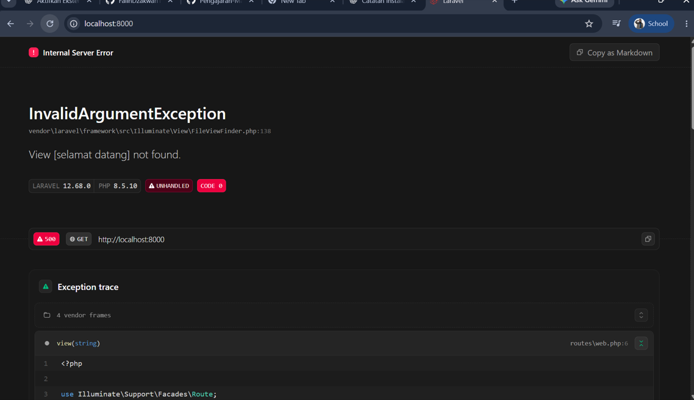
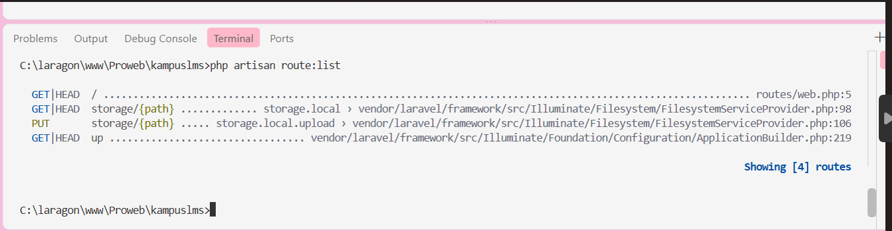

## Elsya Nur Aulia Handayani 
## 10241026 

1. <?php

    use Illuminate\Foundation\Application;
    use Illuminate\Http\Request;

    define('LARAVEL_START', microtime(true));

    // Determine if the application is in maintenance mode...
    if (file_exists($maintenance = __DIR__.'/../storage/framework/maintenance.php')) {
        require $maintenance;
    }

    // Register the Composer autoloader...
    require __DIR__.'/../vendor/autoload.php';

    // Bootstrap Laravel and handle the request...
    /** @var Application $app */
    $app = require_once __DIR__.'/../bootstrap/app.php';

    $app->handleRequest(Request::capture());
   
   Jadi file public/index.php merupakan pintu masuk utama aplikasi Laravel ketika website dijalankan. File ini mengecek apakah aplikasi sedang dalam mode maintenance, memuat Composer, dan mengambil pengaturan aplikasi dari bootstrap/app.php. Setelah itu, Laravel menerima request dari browser dan memprosesnya untuk menampilkan halaman website.

2.  <?php

    use Illuminate\Foundation\Application;
    use Illuminate\Foundation\Configuration\Exceptions;
    use Illuminate\Foundation\Configuration\Middleware;

    return Application::configure(basePath: dirname(__DIR__))
        ->withRouting(
            web: __DIR__.'/../routes/web.php',
            commands: __DIR__.'/../routes/console.php',
            health: '/up',
        )
        ->withMiddleware(function (Middleware $middleware) {
            //
        })
        ->withExceptions(function (Exceptions $exceptions) {
            //
        })->create();

     ->withRouting(
            web: __DIR__.'/../routes/web.php',
            commands: __DIR__.'/../routes/console.php',
            health: '/up',
        ) 

    ini digunakan untuk mengatur alamat atau jalur halaman yang ada di aplikasi. File routes/web.php digunakan untuk mengatur route pada halaman web.

     ->withMiddleware(function (Middleware $middleware) {
            //
        }) 

    Middleware digunakan sebagai pemeriksaan sebelum permintaan diproses oleh aplikasi. Pada project saya, bagian ini belum memiliki pengaturan tambahan. 

    ->withExceptions(function (Exceptions $exceptions) {
            //
        })

    ini digunakan untuk menangani kesalahan atau error yang terjadi pada aplikasi. Pada project saya, bagian ini juga belum memiliki pengaturan tambahan.

3.  Route::get('/', function () {
            return view('welcome');
        });

    Kode tersebut berarti ketika saya membuka alamat utama / pada localhost:8000, Laravel akan menampilkan halaman welcome.
    
    [sebelum dirusak](image.png) 

    
        resources/views/welcome.blade.php

    Saya mengubah teks pada halaman tersebut menjadi “Selamat Datang”. Setelah file disimpan, saya melakukan refresh pada localhost:8000 dan tampilan berhasil berubah menjadi teks yang saya buat. Kesimpulan dari percobaan ini: perubahan pada file welcome.blade.php dapat langsung memengaruhi tampilan yang muncul di browser.

 3. php artisan route:list 

    Perintah ini digunakan untuk melihat daftar route yang tersedia di aplikasi Laravel.

    

    aravel menunjukkan terdapat 4 route.

    Route yang berhubungan dengan halaman utama adalah:

      GET|HEAD   /
        routes/web.php:5

    route / berasal dari file routes/web.php pada baris ke-5.

    Route::get('/', function () {
            return view('welcome');
        });

    Jadi, route yang dibuat di web.php sudah terdaftar dan dapat ditemukan menggunakan php artisan route:list.

    Kesimpulan yang saya lakukkan ini, saya memahami bahwa public/index.php merupakan pintu masuk aplikasi Laravel. Kemudian bootstrap/app.php digunakan untuk mengatur bagian penting seperti route, middleware, dan exception. File routes/web.php digunakan untuk menentukan halaman yang dapat diakses, sedangkan php artisan route:list digunakan untuk melihat route yang sudah terdaftar di aplikasi