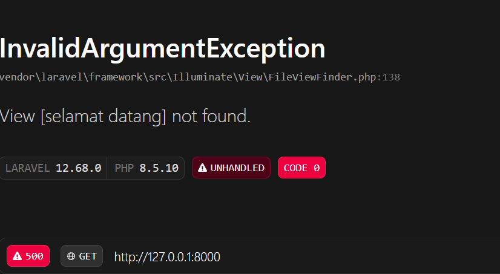
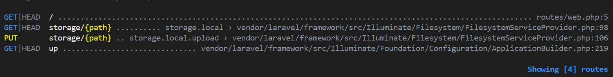

### Nama : Indriani Anwar
#### NIM : 10241036

---
READ — Bedah instalasi Anda sendiri (45 menit)
---
1. Buka public/index.php. Baca dari atas ke bawah. Tulis dalam 3 kalimat apa yang dilakukan berkas ini.

Jawaban : Berkas `public/index.php` adalah **entry point utama aplikasi Laravel** yang pertama kali dijalankan ketika pengguna mengakses aplikasi melalui web. Berkas ini menentukan waktu mulai Laravel, mengecek apakah aplikasi sedang dalam mode maintenance, lalu memuat konfigurasi maintenance jika diperlukan. Setelah itu, berkas ini memuat Composer autoloader, melakukan bootstrap aplikasi melalui `bootstrap/app.php`, menangkap request dari pengguna, dan meneruskannya untuk diproses oleh Laravel.

2. Buka bootstrap/app.php. Identifikasi bagian mana yang mengurus route, mana yang mengurus middleware, mana yang mengurus exception.

Jawaban : 
- Route
```php
->withRouting(
        web: __DIR__.'/../routes/web.php',
        commands: __DIR__.'/../routes/console.php',
        health: '/up',
    )
```
Bagian ini berfungsi untuk menentukan lokasi file route yang digunakan oleh Laravel. Konfigurasi web: ```_DIR__.'/../routes/web.php'``` digunakan untuk mengatur route yang berkaitan dengan halaman web aplikasi, sedangkan commands: ```__DIR__.'/../routes/console.php'``` digunakan untuk mengatur perintah yang dijalankan melalui Laravel Artisan. Selain itu, ```health: '/up'``` digunakan untuk membuat endpoint pengecekan kesehatan aplikasi guna memastikan aplikasi berjalan dengan baik.
- Middleware
```php
->withMiddleware(function (Middleware $middleware) {
        //
    })
```
Bagian ini digunakan untuk mendaftarkan atau mengatur middleware aplikasi. Middleware berfungsi sebagai lapisan pemeriksa sebelum request masuk ke aplikasi, misalnya autentikasi pengguna, pengecekan izin, atau pengaturan keamanan.
- Exception 
```php
->withExceptions(function (Exceptions $exceptions) {
        //
})
```
Bagian ini digunakan untuk mengatur bagaimana Laravel menangani error atau exception, seperti pencatatan error (logging), membuat response ketika terjadi kesalahan, atau menambahkan aturan penanganan error tertentu.

3. Buka routes/web.php. Temukan route yang menghasilkan halaman selamat datang. Ubah teksnya, muat ulang browser, pastikan berubah.

awalnya : 
```php
Route::get('/', function () {
    return view('Welcome');
});
```

Menjadi
```php
Route::get('/', function () {
    return view('selamat datang');
});
```

Hasil dari perubahan : 


Penjelasan : 
Error terjadi karena Laravel tidak menemukan file view yang dipanggil pada fungsi `view()`. Pada awalnya, route menggunakan `return view('Welcome')`, sehingga Laravel mencari file `Welcome.blade.php` di dalam folder `resources/views` dan berhasil ditemukan. Namun, setelah diubah menjadi `return view('selamat datang')`, Laravel mencoba mencari file `selamat datang.blade.php`. Karena file tersebut belum tersedia di folder `resources/views`, Laravel menampilkan pesan error **"View [selamat datang] not found"**. Untuk memperbaikinya, dapat dibuat file view baru dengan nama `selamat datang.blade.php` atau menggunakan nama view yang sudah tersedia seperti `welcome.blade.php` lalu mengubah isi tampilannya sesuai kebutuhan.

4. Jalankan php artisan route:list. Cocokkan keluarannya dengan isi routes/web.php.

Hasil : 


Penjelasan : 
Berdasarkan hasil perintah `php artisan route:list`, route yang terdaftar pada Laravel sudah sesuai dengan isi file `routes/web.php`. Pada file `routes/web.php` terdapat route `Route::get('/', function () { return view('welcome'); });` yang berfungsi untuk membuat halaman utama dengan metode GET pada alamat `/`. Hasil dari `php artisan route:list` menampilkan `GET|HEAD /` dengan lokasi `routes/web.php:5`, yang menunjukkan bahwa Laravel berhasil membaca dan mendaftarkan route tersebut. Selain route utama tersebut, terdapat beberapa route lain seperti `storage/{path}` dan `up` yang merupakan route bawaan Laravel untuk pengelolaan file storage dan pengecekan kesehatan aplikasi. Dengan demikian, dapat disimpulkan bahwa konfigurasi route pada `routes/web.php` telah berjalan dengan benar dan sudah terhubung dengan sistem routing Laravel.
