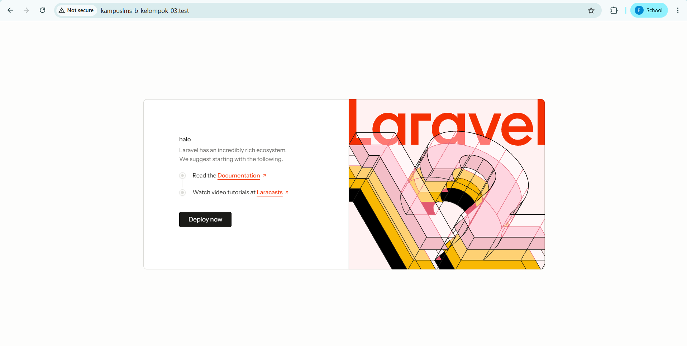

#### Nama : Falih Dzakwan
#### NIM  : 10241028

## READ

1. Buka public/index.php. Baca dari atas ke bawah. Tulis dalam 3 kalimat apa yang dilakukan berkas ini.

    File ini adalah pintu masuk utama untuk request HTTP ke aplikasi Laravel, pertama tama akan melakukan pengecekan mode maintenance, kemudian memuat semua class yang dibutuhkan Laravel. Selanjutnya menjalankan file bootstrap/app.php dan file itu mengembalikan sebuah objek Application untuk menyiapkan service provider, routing dan middleware. Terakhir request dari browser ditangkap lewat Request::capture() dan diserahkan ke $app->handleRequest(), yang memproses seluruh alur dan mengirimkannya kembali ke browser.

2. Buka bootstrap/app.php. Identifikasi bagian mana yang mengurus route, mana yang mengurus middleware, mana yang mengurus exception.

Bagian ini yang mengurus route
```php
->withRouting(
        web: __DIR__.'/../routes/web.php',
        commands: __DIR__.'/../routes/console.php',
        health: '/up',
    )
```

Bagian ini yang mengurus middleware
```php
->withMiddleware(function (Middleware $middleware) {
        //
    })
```
Dan bagian inilah yang mengurus exception
```php
->withExceptions(function (Exceptions $exceptions) {
        //
    })
```
3. Buka routes/web.php. Temukan route yang menghasilkan halaman selamat datang. Ubah teksnya, muat ulang browser, pastikan berubah.



4. Jalankan php artisan route:list. Cocokkan keluarannya dengan isi routes/web.php.

Hasil yang diberikan setelah menjalankan php artisan route:list adalah seperti berikut

```
GET|HEAD  / ............................................................................................................. routes/web.php:5
GET|HEAD  storage/{path} ............. storage.local › vendor/laravel/framework/src/Illuminate/Filesystem/FilesystemServiceProvider.php:98
PUT       storage/{path} ..... storage.local.upload › vendor/laravel/framework/src/Illuminate/Filesystem/FilesystemServiceProvider.php:106
GET|HEAD  up ................................. vendor/laravel/framework/src/Illuminate/Foundation/Configuration/ApplicationBuilder.php:219
```

Pada keluaran pertama disitu memperlihatkan list yang mengarah ke baris 5 di file routes/web.php berikut
```php
Route::get('/', function () {
    return view('welcome');
});
```
Jadi route:list ini menampilkan rute dengan method HTTP seperti get(), dan karena pada file web.php tersebut menggunakan get() jadinya muncul di list tersebut