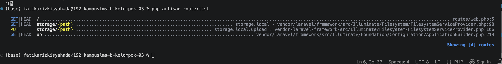

### Nama : Fatika Rizki Syahada
#### NIM : 10241030
1. Buka public/index.php. Baca dari atas ke bawah. Tulis dalam 3 kalimat apa yang dilakukan berkas ini.

    Jawab: File ini berfungsi sebagai titik masuk utama aplikasi Laravel ketika ada request dari browser. File ini mengambil Laravel dari bootstrap/app.php lalu aplikasi untuk menangani request yang masuk. Setelah request diproses oleh Laravel, hasilnya dikembalikan kepada browser sebagai response.


2. Buka `bootstrap/app.php`. Identifikasi bagian mana yang mengurus route, mana yang mengurus middleware, mana yang mengurus exception.
Jawab:
- bootstrap/app.php, bagian withRouting() digunakan untuk mengatur routing aplikasi, termasuk menentukan file route seperti routes/web.php.

 - withMiddleware() digunakan untuk mengatur middleware yang digunakan aplikasi. 
 
 - withExceptions() digunakan untuk mengatur penanganan exception/error dalam aplikasi.

3. Buka `routes/web.php`. Temukan route yang menghasilkan halaman selamat datang. Ubah teksnya, muat ulang browser, pastikan berubah.

awalnya : 
```php
Route::get('/', function () {
    return view('Welcome');
});
```
Menjadi
```php
Route::get('/', function () {
    return view('Selamat Datang maba');
});
```
Hasil:


Karena Laravel lagi nyari file view bernama Selamat datang maba.blade.php di dalam folder resources/views/, tapi gak ketemu. Makanya dia nge-throw InvalidArgumentException.

Alur yang kejadian:
Browser -> public/index.php -> bootstrap/app.php -> routes/web.php:5 -> view('Selamat datang maba') -> FileViewFinder.php:138 -> GAGAL

4. Jalankan `php artisan route:list`. Cocokkan keluarannya dengan isi `routes/web.php`.

Hasil:




Penjelasan: 

Hasil php artisan route:list sudah cocok sama isi routes/web.php. Route / di baris 5 itu buat halaman utama, dan muncul sebagai GET|HEAD / di list, artinya udah kebaca sama Laravel lewat bootstrap/app.php. Sisanya 3 route yaitu storage/{path} dan up itu bawaan Laravel. Sempat error View not found karena nulis view('Selamat datang maba'), padahal view() itu buat manggil file, bukan teks. Setelah diganti jadi return 'Selamat datang maba'; langsung normal.