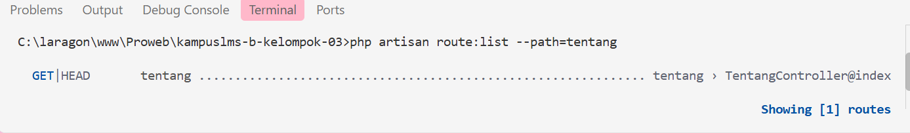

## Elsya Nur Aulia Handayani 
## 10241026 

2.3 Read → Break → Fix → Build
READ — Telusuri satu request penuh (30 menit)
Ambil route /tentang yang Anda buat minggu lalu. Tanpa AI, tulis di catatan Anda:
---

1. Baris mana di routes/web.php yang menangkapnya?
   jawab:  Route tersebut menangkap URL /tentang.
```php
   Route::get('/tentang', function () {
    return view('tentang');
}); 

```

2. Kalau ditangani controller, berkas dan method mana?
   Jawab:
- File: app/Http/Controllers/PageController.php
- Method: tentang() 

Method : 
```php
public function index()
    {
        return view('tentang');
    }
``` 

3. View mana yang dikembalikan? Di path apa persisnya?
   Jawab:
   - resources/views/tentang.blade.php
  
```php
   <x-layout title="Tentang Kami">

    <h1>Kelompok 03</h1>

    <p>Anggota:</p>

    <ul>
        <li>Elsya Nur Aulia Handayani</li>
        <li>Falih Dzakwan</li>
        <li>Fatika Rizki Syahada</li>
        <li>Indriani Anwar</li>
    </ul>

</x-layout>

```


4. Layout apa yang membungkusnya?
   Jawab:

- resources/views/components/layout.blade.php
- Layout digunakan untuk menyimpan bagian yang sama pada setiap halaman, seperti navbar, footer, dan struktur HTML dasar. Dengan menggunakan layout, kode menjadi lebih rapi karena tidak perlu menuliskan header dan navigasi berulang kali pada setiap view.
  
```php
<!DOCTYPE html>
<html lang="id">
<head>
    <meta charset="UTF-8">
    <title>{{ $title ?? 'KampusLMS' }}</title>
    @vite(['resources/css/app.css', 'resources/js/app.js'])
</head>

<body>

    <nav>

        <div class="text-2xl font-bold mr-auto">
             KampusLMS
        </div>


        <a href="{{ route('dashboard') }}">
            Dashboard
        </a>


        <a href="{{ route('courses.index') }}">
            Mata Kuliah
        </a>


        <a href="{{ route('tentang') }}">
            Tentang
     </a>

    </nav>

    <main>
        {{ $slot }}
    </main>

</body>
</html>
```
Pada file layout.blade.php, isi halaman akan ditampilkan melalui: {{ $slot }}


5. Jalankan php artisan route:list --path=tentang. Cocok dengan analisis Anda?
   Jawab: 

   
   
analisis sebelumnya karena URL /tentang memang diarahkan ke method index() pada TentangController. Ketika pengguna mengakses halaman /tentang, Laravel akan mencocokkan route tersebut, menjalankan TentangController@index, kemudian mengembalikan view yang ditampilkan kepada pengguna.
   
---


| No | Yang dirusak | Prediksi sebelum mencoba | Pesan error sebenarnya |
|----|--------------|--------------------------|------------------------|
| 1 | Mengubah `Route::get` menjadi `Route::post` pada route daftar mata kuliah | Halaman tidak dapat dibuka karena browser mengirim request GET, sedangkan Laravel hanya menerima method POST. | `The GET method is not supported for route courses. Supported methods: POST.` |
| 2 | Mengubah nama view pada `return view(...)` menjadi view yang tidak tersedia | Laravel tidak menemukan file Blade yang dipanggil sehingga halaman gagal ditampilkan. | `View [indri] not found.` |
| 3 | Menghapus `->name('courses.show')`, lalu membuka halaman yang menggunakan `route('courses.show')` | Laravel tidak dapat membuat URL karena route dengan nama tersebut sudah tidak terdaftar. | `Route [courses.show] not defined.` |
| 4 | Memindahkan `/courses/{course}` ke atas `/courses/create`, lalu membuka `/courses/create` | Laravel akan membaca `create` sebagai nilai parameter `{course}` karena route parameter berada lebih dahulu. | 404 Not Found |
| 5 | Mengganti `{{ $nama }}` menjadi `{!! $nama !!}`, kemudian mengisi `$nama` dengan `<script>alert('XSS')</script>` | HTML akan ditampilkan tanpa proses escaping sehingga script JavaScript dapat dijalankan di browser. | Muncul pop-up pada browser yang menunjukkan kerentanan **XSS (Cross-Site Scripting)**. |
| 6 | Menghapus `@vite(...)` dari layout Blade | File CSS dan JavaScript tidak akan dimuat karena koneksi dengan Vite dihilangkan. | Tampilan halaman kehilangan styling|
| 7 | Menghentikan proses `npm run dev`, kemudian memuat ulang halaman | Laravel tidak dapat mengambil asset dari Vite development server yang sedang berhenti. | Asset CSS/JavaScript gagal dimuat atau muncul pesan `Vite manifest not found at: C:\laragon\www\Pemroweb\kampuslms-b-kelompok-03\public\build/manifest.json |
| 8 | Memanggil `route('courses.show')` tanpa memberikan parameter | Laravel membutuhkan nilai `{course}` untuk membentuk URL route tersebut. | Missing required parameter for [Route: courses.show] [URI: courses/{course}] [Missing parameter: course]. |
