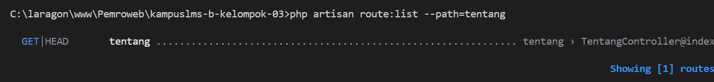

### Nama : Indriani Anwar
#### NIM : 10241036

---
READ — Telusuri satu request penuh (30 menit)
Ambil route /tentang yang Anda buat minggu lalu. Tanpa AI, tulis di catatan Anda:
---
1. Baris mana di routes/web.php yang menangkapnya?

Jawaban : 
```php
Route::get('/tentang', function () {
    return view('tentang');
```

2. Kalau ditangani controller, berkas dan method mana?
berkas : app/Http/Controllers/TentangController.php

Method : 
```php
public function index()
    {
        return view('tentang');
    }
```

3. View mana yang dikembalikan? Di path apa persisnya?

Penjelasan : view yang dikembalikan pada path tentang "resources/views/tentang.blade.php"
```php
<x-layout title="Tentang Kami">

    <h1>Kelompok 03</h1>

    <p>Anggota:</p>

    <ul>
        <li>Elsya Nur Aulia Handayani</li>
        <li>Falih Dzakwan</li>
        <li>Fatika Rizki Syahada</li>
        <li>Indriani Anwar</li>
    </ul>

</x-layout>
```

4. Layout apa yang membungkusnya?
layout yang membungkus terdapat pada "resources/views/components/layout.blade.php", sehingga pada "resources/views/tentang.blade.php" tidak mengandung html didalamnya dan hanya mendirect dari file layout.
```php
<!DOCTYPE html>
<html lang="id">
<head>
    <meta charset="UTF-8">
    <title>{{ $title ?? 'KampusLMS' }}</title>

    @vite(['resources/css/app.css', 'resources/js/app.js'])
</head>

<body>

    <nav>
        <a href="{{ route('dashboard') }}">Dashboard</a>
        <a href="{{ route('courses.index') }}">Mata Kuliah</a>
        <a href="{{ route('tentang') }}">Tentang</a>
    </nav>

    <main>
        {{ $slot }}
    </main>

</body>
</html>
```

5. Jalankan php artisan route:list --path=tentang. Cocok dengan analisis Anda?

Penjelasan : Perintah php artisan route:list --path=tentang digunakan untuk menampilkan daftar route yang memiliki URL atau path yang mengandung kata "tentang". Perintah ini membantu memastikan bahwa route /tentang sudah terdaftar.

---
BREAK — Delapan kerusakan (40 menit)
---

| No | Yang dirusak | Prediksi sebelum mencoba | Pesan error sebenarnya |
|----|--------------|--------------------------|------------------------|
| 1 | Mengubah `Route::get` menjadi `Route::post` pada route daftar mata kuliah | Halaman tidak dapat dibuka karena browser mengirim request GET, sedangkan Laravel hanya menerima method POST. | `The GET method is not supported for route courses. Supported methods: POST.` |
| 2 | Mengubah nama view pada `return view(...)` menjadi view yang tidak tersedia | Laravel tidak menemukan file Blade yang dipanggil sehingga halaman gagal ditampilkan. | `View [indri] not found.` |
| 3 | Menghapus `->name('courses.show')`, lalu membuka halaman yang menggunakan `route('courses.show')` | Laravel tidak dapat membuat URL karena route dengan nama tersebut sudah tidak terdaftar. | `Route [courses.show] not defined.` |
| 4 | Memindahkan `/courses/{course}` ke atas `/courses/create`, lalu membuka `/courses/create` | Laravel akan membaca `create` sebagai nilai parameter `{course}` karena route parameter berada lebih dahulu. | 404 Not Found |
| 5 | Mengganti `{{ $nama }}` menjadi `{!! $nama !!}`, kemudian mengisi `$nama` dengan `<script>alert('XSS')</script>` | HTML akan ditampilkan tanpa proses escaping sehingga script JavaScript dapat dijalankan di browser. | Muncul pop-up pada browser yang menunjukkan kerentanan **XSS (Cross-Site Scripting)**. |
| 6 | Menghapus `@vite(...)` dari layout Blade | File CSS dan JavaScript tidak akan dimuat karena koneksi dengan Vite dihilangkan. | Tampilan halaman kehilangan styling|
| 7 | Menghentikan proses `npm run dev`, kemudian memuat ulang halaman | Laravel tidak dapat mengambil asset dari Vite development server yang sedang berhenti. | Asset CSS/JavaScript gagal dimuat atau muncul pesan `Vite manifest not found at: C:\laragon\www\Pemroweb\kampuslms-b-kelompok-03\public\build/manifest.json |
| 8 | Memanggil `route('courses.show')` tanpa memberikan parameter | Laravel membutuhkan nilai `{course}` untuk membentuk URL route tersebut. | Missing required parameter for [Route: courses.show] [URI: courses/{course}] [Missing parameter: course]. |

## Kesimpulan

Dari percobaan BREAK dapat diketahui bahwa setiap komponen Laravel memiliki keterkaitan satu sama lain. Kesalahan pada method HTTP, nama route, urutan route, view, asset, maupun parameter dapat menyebabkan aplikasi mengalami error. Percobaan ini membantu memahami bahwa pengembang tidak hanya perlu menulis kode, tetapi juga memahami bagaimana Laravel memproses setiap request dan response.

---
BUILD — Kerangka KampusLMS (sisa waktu)
---
1. Layout x-layout dengan navbar berisi: Dashboard, Mata Kuliah, Tentang.
```php
<!DOCTYPE html>
<html lang="id">
<head>
    <meta charset="UTF-8">
    <title>{{ $title ?? 'KampusLMS' }}</title>
    @vite(['resources/css/app.css', 'resources/js/app.js'])
</head>

<body>

    <nav>
        <a href="{{ route('dashboard') }}">Dashboard</a>
        <a href="{{ route('courses.index') }}">Mata Kuliah</a>
        <a href="{{ route('tentang') }}">Tentang</a>
    </nav>

    <main>
        {{ $slot }}
    </main>

</body>
</html>
```
2. CourseController dengan index dan show.
```php
// Menampilkan daftar mata kuliah
    public function index()
    {
        $courses = Course::all();

        return view('courses.index', compact('courses'));
    }


    // Menampilkan detail satu mata kuliah
    public function show(Course $course)
    {
        return view('courses.show', compact('course'));
    }
```
3. courses/index.blade.php — tabel daftar mata kuliah (kode, nama, SKS, dosen).
```php
{{-- resources/views/courses/index.blade.php --}}
<x-layout title="Daftar Mata Kuliah">

    <h1>Daftar Mata Kuliah</h1>

    <p>Jumlah course: {{ count($courses) }}</p>

    @if (count($courses) === 0)
        <p>Belum ada data mata kuliah.</p>
    @else
        <table border="1" cellpadding="8" cellspacing="0">
            <thead>
                <tr>
                    <th>Kode</th>
                    <th>Nama</th>
                    <th>SKS</th>
                    <th>Dosen</th>
                    <th>Aksi</th>
                </tr>
            </thead>
            <tbody>
                @foreach ($courses as $course)
                    <tr>
                        <td>{{ $course->kode }}</td>
                        <td>{{ $course->nama }}</td>
                        <td>{{ $course->sks }}</td>
                        <td>{{ $course->dosen }}</td>
                        <td>
                            <a href="{{ route('courses.show', $course) }}">
                                Lihat Detail
                            </a>
                        </td>
                    </tr>
                @endforeach
            </tbody>
        </table>
    @endif

</x-layout>
```
4. courses/show.blade.php — detail satu mata kuliah.
```php
{{-- resources/views/courses/show.blade.php --}}
<x-layout title="Detail Mata Kuliah">

    <div class="container">
        <h1>{{ $course['name'] }}</h1>

        <p>
            <strong>Kode Mata Kuliah:</strong>
            {{ $course['code'] }}
        </p>

        <p>
            <strong>Dosen:</strong>
            {{ $course['lecturer'] }}
        </p>

        <p>
            <strong>Deskripsi:</strong>
            {{ $course['description'] }}
        </p>

        <a href="{{ route('courses.index') }}">
            ← Kembali ke Daftar Mata Kuliah
        </a>
    </div>

</x-layout>
```
5. Semua tautan memakai route().
```php
Route::get('/courses', [CourseController::class, 'index'])
    ->name('courses.index');

Route::get('/courses/{course}', [CourseController::class, 'show'])
    ->name('courses.show');
```
6. Halaman 404 kustom (resources/views/errors/404.blade.php).
```php
<!DOCTYPE html>
<html lang="id">
<head>
    <meta charset="UTF-8">
    <meta name="viewport" content="width=device-width, initial-scale=1.0">
    <title>404 - Halaman Tidak Ditemukan</title>
</head>
<body>
    <div class="container">
        <div class="illustration">🔍</div>
        <div class="code">404</div>
        <div class="title">Halaman Tidak Ditemukan</div>
        <p class="desc">
            Maaf, halaman yang Anda cari tidak tersedia atau mungkin sudah dipindahkan.
        </p>
        <a href="{{ url('/') }}" class="btn">Kembali ke Beranda</a>
    </div>
</body>
</html>

```
