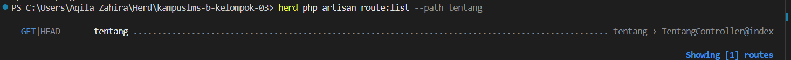

#### Nama : Falih Dzakwan
#### NIM  : 10241028
#### WEEK 2

READ

1. Baris mana di routes/web.php yang menangkapnya?

    Yang menangkapnya berada di baris 12 berikut 
```php
Route::get('/tentang', [TentangController::class, 'index'])
    ->name('tentang');
```
2. Kalau ditangani controller, berkas dan method mana?

    Ada di dalam file app/Http/Controlles/TentangController.php
berikut methodnya:
```php
    public function index()
    {
        return view('tentang');
    }
```

3. View mana yang dikembalikan? Di path apa persisnya?

    Viewnya akan dikembalikan ke file yang ada di resources/views/tentang.blade.php

4. Layout apa yang membungkusnya?

    Layout yang membukusnya adalah x-layout, dengan viewnya berada di resources/views/components/layout.blade.php
5. Jalankan `php artisan route:list --path=tentang`. Cocok dengan analisis Anda?

Output route:list mengonfirmasi route /tentang memang terdaftar dan aktif. Bagian Action di output TentangController@index sama dengan yang ada di file TentangController.php, method index().
