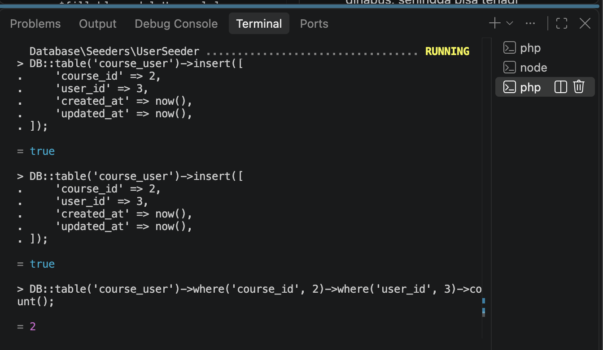

### Nama : Fatika Rizki Syahada
#### NIM : 10241030

---
BREAK — Lima kerusakan (45 menit)

1. Hapus unique(['course_id','user_id']) dari course_user, lalu daftarkan mahasiswa yang sama dua kali

Ketika menghapus table unik dibawah ini : 
```php
$table->unique([
    'course_id',
    'user_id'
])
```

dan kita menambahkan course_id : 2 dan juga user_id : 3, maka hasilnya adalah true 



Pada percobaan pertama, constraint unique(['course_id', 'user_id']) pada tabel course_user dihapus. 

Constraint tersebut sebenarnya berfungsi untuk mencegah mahasiswa yang sama terdaftar lebih dari satu kali pada mata kuliah yang sama.


Setelah constraint dihapus, saya mencoba memasukkan data mahasiswa dengan user_id = 3 ke mata kuliah dengan course_id = 2 sebanyak dua kali.

 Kedua data tersebut berhasil disimpan oleh database tanpa menghasilkan error.
Kemudian dilakukan pengecekan jumlah data menggunakan query:

```
DB::table('course_user')
    ->where('course_id', 2)
    ->where('user_id', 3)
    ->count();
```
Hasilnya
= 2

Hasil tersebut menunjukkan bahwa data mahasiswa dan mata kuliah yang sama dapat tercatat dua kali. Hal ini membuktikan bahwa ketika unique constraint dihapus, database tidak lagi mencegah terjadinya data duplikat pada relasi mahasiswa dan mata kuliah.

2. Tambahkan role ke $fillable model User, lalu kirim request pembuatan user dengan role=admin lewat form yang tidak punya field role

Ketika kita menambah role kedalam fillable, maka hasilnya akan seperti berikut : 
```php
protected $fillable = [
        'name',
        'email',
        'password',
        'role',
    ];
```

Hasilnya menunjukkan bahwa nilai admin berhasil masuk ke database. Hal ini terjadi karena role sudah dimasukkan ke $fillable, sehingga Laravel mengizinkan atribut tersebut diisi melalui mass assignment.

Percobaan ini menunjukkan bahwa memasukkan atribut sensitif seperti role ke dalam $fillable dapat menjadi masalah keamanan karena pengguna dapat mengirimkan nilai yang seharusnya hanya dapat ditentukan oleh sistem atau administrator.

3. Ganti seluruh $fillable dengan protected $guarded = []; lalu ulangi nomor 2

sebelumnya menggunakan : 
```php 
protected $fillable = [
        'name',
        'email',
        'password',
        'role',
    ];
```

lalu diubah menjadi : 
```php
protected $guarded = [];
```

Hasilnya, atribut role tetap dapat diisi melalui mass assignment tanpa harus didaftarkan secara khusus ke $fillable.

Hal ini menunjukkan bahwa $guarded = [ ] membuat seluruh atribut pada model tidak memiliki perlindungan dari mass assignment. 

Kondisi tersebut berbahaya apabila terdapat atribut penting seperti role, is_admin, atau atribut lain yang seharusnya tidak dapat diubah langsung oleh pengguna.

Dari percobaan ini penggunaan $fillable lebih aman karena developer dapat menentukan secara jelas atribut mana saja yang boleh diisi melalui mass assignment.

4. Kosongkan isi down() di satu migrasi, lalu jalankan php artisan migrate:refresh

awalnya : 
```php 
public function down(): void
    {
        Schema::dropIfExists('courses');
    }
```

isi down di kosongkan, menjadi : 
```php 
public function down(): void
    {
        
    }
```

Isi method down() pada migration dihapus. Setelah itu dijalankan:
php artisan migrate:refresh

Method down() digunakan untuk mengembalikan perubahan yang dibuat oleh migration.

Jika down() dikosongkan, Laravel tidak memiliki perintah untuk mengembalikan perubahan tersebut. Akibatnya, proses rollback atau refresh migration dapat mengalami masalah.
Dari percobaan ini dapat diketahui bahwa method down() penting dan sebaiknya dibuat agar migration dapat dikembalikan dengan benar.

5. Ubah restrictOnDelete pada lecturer_id menjadi cascadeOnDelete, lalu hapus satu dosen

awalnya lecturer_id : 
```php 
$table->foreignId('lecturer_id')
    ->constrained('users')
    ->restrictOnDelet();
```

diubah menjadi : 
```php 
$table->foreignId('lecturer_id')
    ->constrained('users')
    ->cascadeOnDelete();
```
Dengan cascadeOnDelete(), ketika dosen dihapus, data course yang berhubungan dengan dosen tersebut juga ikut terhapus.
Sedangkan restrictOnDelete() akan mencegah dosen dihapus jika masih digunakan oleh data lain.

Percobaan ini menunjukkan bahwa cascadeOnDelete() harus digunakan dengan hati-hati karena dapat menyebabkan data yang berhubungan ikut terhapus.