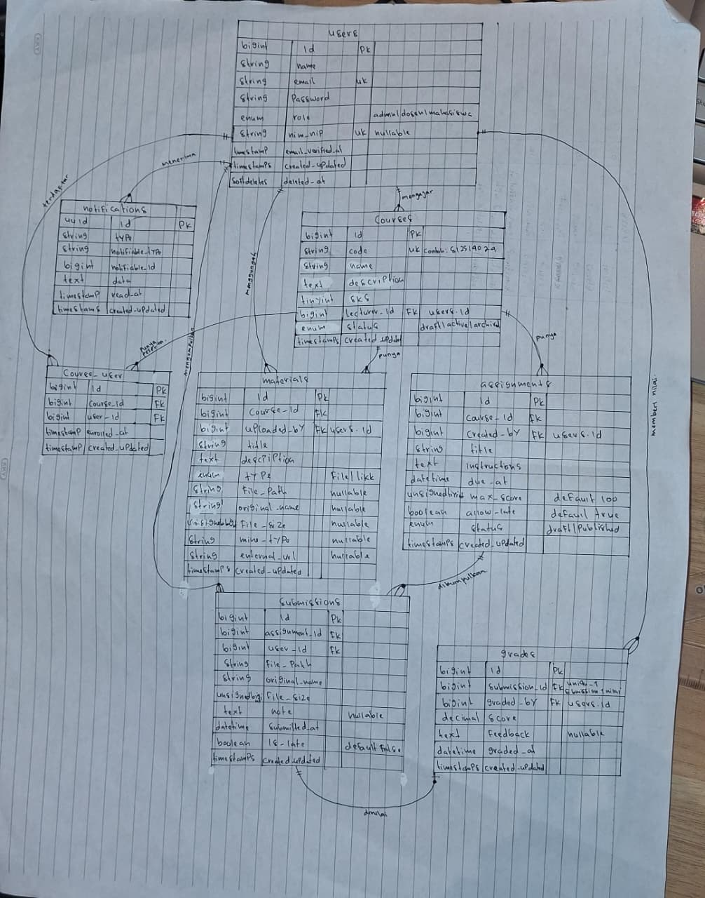
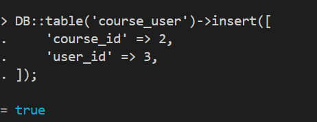
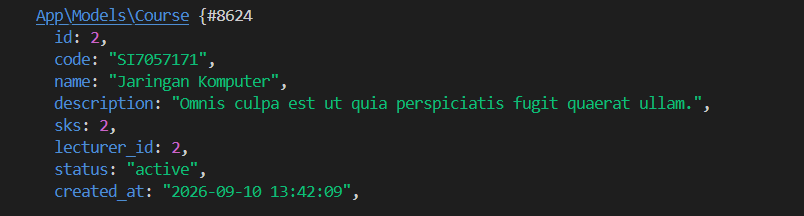
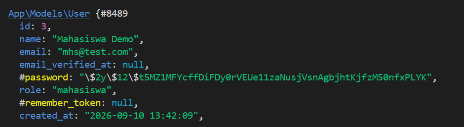

### Nama : Indriani Anwar
#### NIM : 10241036
---
READ — Baca skema sebelum menulisnya (30 menit)

ERD 


1. Untuk setiap foreign key, tentukan perilaku onDelete-nya dan tuliskan alasannya.

| Foreign Key | Relasi | `onDelete` | Alasan |
|---|---|---|---|
| `courses.lecturer_id → users.id` | User (dosen) mengajar course | `restrict` | Data course tidak dapat dihapus jika masih memiliki referensi dosen. Penghapusan akun dosen harus dicek terlebih dahulu agar tidak menghilangkan histori akademik yang masih digunakan. |
| `course_user.course_id → courses.id` | Course memiliki peserta | `cascade` | Jika sebuah course dihapus, seluruh data peserta yang terdaftar pada course tersebut akan ikut dihapus karena data pendaftaran tidak memiliki arti tanpa course induknya. |
| `course_user.user_id → users.id` | User terdaftar dalam course | `cascade` | Jika data user dihapus, seluruh data keikutsertaan user pada course akan ikut terhapus karena relasi tersebut sudah tidak diperlukan. |
| `materials.course_id → courses.id` | Course memiliki materi | `cascade` | Materi merupakan bagian dari course sehingga ketika course dihapus, seluruh materi yang terkait juga ikut dihapus untuk mencegah data yatim (*orphan record*). |
| `materials.uploaded_by → users.id` | User mengunggah materi | `set null` | Jika akun pengunggah dihapus, data materi tetap dipertahankan karena masih digunakan dalam course. Kolom `uploaded_by` dikosongkan karena pengguna asal sudah tidak tersedia. |
| `assignments.course_id → courses.id` | Course memiliki tugas | `cascade` | Assignment bergantung pada course sebagai induknya. Jika course dihapus, seluruh tugas terkait ikut dihapus karena tidak memiliki konteks tanpa course tersebut. |
| `assignments.created_by → users.id` | User membuat tugas | `restrict` | User yang membuat tugas tidak dapat dihapus selama masih memiliki tugas terkait. Hal ini menjaga informasi pembuat tugas dan histori akademik tetap tersedia. |
| `submissions.assignment_id → assignments.id` | Assignment memiliki submission | `cascade` | Submission hanya merupakan jawaban dari assignment tertentu. Jika assignment dihapus, data pengumpulan mahasiswa juga ikut dihapus karena tidak memiliki referensi tugas. |
| `submissions.user_id → users.id` | User mengumpulkan tugas | `restrict` | Data submission mahasiswa harus tetap tersedia sebagai bukti pengumpulan dan histori akademik. User tidak dapat dihapus selama masih memiliki data submission. |
| `grades.submission_id → submissions.id` | Submission memiliki nilai | `cascade` | Nilai hanya berlaku untuk submission tertentu. Jika submission dihapus, data nilai terkait juga harus ikut dihapus agar tidak terdapat nilai tanpa sumber penilaian. |
| `grades.graded_by → users.id` | User memberi nilai | `restrict` | Data pengguna yang memberikan nilai harus tetap tersedia untuk menjaga transparansi dan histori proses penilaian. Penghapusan user harus dilakukan setelah relasi penilaian ditangani. |


2. Jawab: kalau seorang dosen dihapus, apa yang terjadi pada mata kuliahnya? Kenapa dirancang begitu?

Jika seorang dosen dihapus dari sistem, maka mata kuliah yang pernah diampu oleh dosen tersebut tidak ikut terhapus. Relasi antara tabel users dan courses pada atribut courses.lecturer_id sebaiknya menggunakan perilaku onDelete: restrict untuk mencegah penghapusan dosen yang masih memiliki keterkaitan dengan data mata kuliah. Hal ini bertujuan menjaga integritas data akademik karena mata kuliah merupakan data penting yang berhubungan dengan peserta, materi, tugas, submission, dan nilai mahasiswa.

Namun, apabila penghapusan dosen tetap dipaksakan, sistem dapat menerapkan mekanisme set null pada atribut lecturer_id, sehingga data mata kuliah tetap tersedia tetapi tidak lagi memiliki referensi terhadap dosen tersebut. Dengan pendekatan ini, informasi akademik seperti materi, tugas, dan aktivitas mahasiswa tetap tersimpan, sementara hubungan dengan dosen yang sudah tidak aktif dihapus. Oleh karena itu, penghapusan dosen sebaiknya dilakukan melalui proses verifikasi terlebih dahulu, seperti pemindahan mata kuliah ke dosen lain atau mengosongkan atribut pengampu ketika akun dosen benar-benar sudah tidak digunakan.

---

3. Jawab: kenapa grades.submission_id bersifat unique, bukan sekadar index biasa?

Kolom `grades.submission_id` dibuat menggunakan constraint **unique** karena memiliki aturan bahwa satu submission hanya boleh memiliki satu nilai. Setiap pengumpulan tugas dari mahasiswa hanya dapat dinilai satu kali sehingga hubungan antara tabel `submissions` dan `grades` adalah relasi **one-to-one (1:1)**.

Jika hanya menggunakan index biasa, database masih memungkinkan terdapat beberapa record nilai untuk satu submission yang sama. Kondisi tersebut dapat menyebabkan inkonsistensi data, misalnya satu tugas memiliki beberapa nilai berbeda dari proses penilaian yang sama. Dengan menggunakan `unique`, database dapat memastikan bahwa setiap submission hanya memiliki maksimal satu data grade.

Selain meningkatkan performa pencarian, penggunaan unique constraint juga berfungsi sebagai validasi pada tingkat database sehingga aturan bisnis tetap terjaga meskipun terjadi kesalahan pada sisi aplikasi.

---
BREAK — Lima kerusakan (45 menit)

1. Hapus unique(['course_id','user_id']) dari course_user, lalu daftarkan mahasiswa yang sama dua kali

Ketika menghapus table unik dibawah ini : 
```php
$table->unique([
    'course_id',
    'user_id'
])
```

dan kita menambahkan course_id : 2 dan juga user_id : 3, maka hasilnya adalah true 


padahal sebelumnya, course_id : 2 terdaftar sebagai jaringan komputer dan user_id : 3 terdaftar sebagai mahasiswa demo 

course_id : 2


user_id : 3


data tersebut bisa di input double dikarenakan table unique telah dihapus, sehingga bisa terjadi double id.

2. Tambahkan role ke $fillable model User, lalu kirim request pembuatan user dengan role=admin lewat form yang tidak punya field role

Ketika kita menambah role kedalam fillable, maka hasilnya akan seperti berikut : 
```php
protected $fillable = [
        'name',
        'email',
        'password',
        'role',
    ];
```

Maka ketika user menginput dirinya sebagai admin, akan otomatis terdaftar. sehingga, hal tersebut tidak diperbolehkan, maka role pada protected $fillable disarankan dihapus dikarenakan hal tersebut berbahaya bagi keamanan.

3. Ganti seluruh $fillable dengan protected $guarded = []; lalu ulangi nomor 2

sebelumnya menggunakan : 
```php 
protected $fillable = [
        'name',
        'email',
        'password',
        'role',
    ];
```

lalu diubah menjadi : 
```php
protected $guarded = [];
```

maka ketika user menginput data, semua atribut atau kolom termasuk role bisa diisi melalui mass assignment. Sehingga kode tersebut tidak disarankan untuk digunakan, dan sebaiknya menggunakan $fillable dikarenakan atribut yang dapat diterima telah diatur, sehingga tidak rentan dari kebocoran data.

4. Kosongkan isi down() di satu migrasi, lalu jalankan php artisan migrate:refresh

awalnya : 
```php 
public function down(): void
    {
        Schema::dropIfExists('courses');
    }
```

isi down di kosongkan, menjadi : 
```php 
public function down(): void
    {
        
    }
```

ketika menjalankan ```php artisan migrate:refresh``` maka hasilnya adalah error (migration failed) dikarenakan ```php artisan migrate:refresh``` digunakan untuk melakukan  rollback migration dan migrate ulang. Dikarenakan isi dari down tersebut kosong dan tidak terdapat schema yang seharusnya, maka data yang ada tidak dapat dilakukakn rollback dan data course tidak dapat dikembalikan ulang. 

5. Ubah restrictOnDelete pada lecturer_id menjadi cascadeOnDelete, lalu hapus satu dosen

awalnya lecturer_id : 
```php 
$table->foreignId('lecturer_id')
    ->constrained('users')
    ->restrictOnDelet();
```

diubah menjadi : 
```php 
$table->foreignId('lecturer_id')
    ->constrained('users')
    ->cascadeOnDelete();
```

maka yang terjadi adalah, ketika user pada lecturer_id dihapus, maka seluruh data di dalamnya akan ikut terhapus, disarankan menggunakan ```restrictOnDelete``` dikarenakan parent tidak dapat dihapus jika masih memiliki data didalam parent tersebut. 

--- 
BUILD — Milestone M1 (tugas terstruktur + belajar mandiri)

1. Implementasi Migration, Constraint, Index, dan Reversible Migration

Pada tahap ini dilakukan pembuatan seluruh migration sesuai dengan struktur database yang telah ditentukan. Setiap tabel dibuat dengan memperhatikan hubungan antar tabel, constraint, index, serta aturan penghapusan data agar struktur database dapat berjalan dengan baik.

Dalam migration digunakan foreign key untuk menghubungkan data antar tabel, unique constraint untuk mencegah terjadinya data duplikat, serta index untuk membantu meningkatkan performa pencarian data. Salah satu contoh penerapan foreign key terdapat pada relasi antara tabel mata kuliah dengan tabel pengguna sebagai dosen.

```php
$table->foreignId('lecturer_id')
    ->constrained('users')
    ->restrictOnDelete();
```

Penggunaan restrictOnDelete() bertujuan agar data dosen tidak dapat dihapus apabila masih memiliki data mata kuliah yang berhubungan. Hal tersebut dilakukan untuk menjaga konsistensi data pada database.

Selain membuat struktur tabel, setiap migration juga dibuat secara reversible dengan menyediakan fungsi down(). Fungsi tersebut digunakan untuk mengembalikan perubahan database ketika melakukan rollback migration.

Contoh:
```php
public function down(): void
{
    Schema::dropIfExists('courses');
}
```
Pengujian migration dilakukan menggunakan perintah:

```php artisan migrate:fresh --seed```

dan:

```php artisan migrate:refresh```

Hasil pengujian menunjukkan bahwa seluruh migration berhasil dijalankan dan dapat dilakukan rollback sehingga struktur database bersifat reversible.

2. Implementasi Model, Relasi, $fillable, dan casts()

Pada tahap ini dibuat seluruh model berdasarkan struktur database yang telah dibuat. Setiap model memiliki relasi sesuai dengan hubungan antar tabel menggunakan fitur relationship Laravel.

Relasi antara mata kuliah dengan dosen menggunakan belongsTo karena setiap mata kuliah memiliki satu dosen yang bertanggung jawab.

Contoh:
```php
public function lecturer()
{
    return $this->belongsTo(User::class, 'lecturer_id');
}
```
Selain itu, relasi antara mahasiswa dengan mata kuliah menggunakan belongsToMany karena hubungan tersebut menggunakan tabel pivot.

Contoh:
```php
public function courses()
{
    return $this->belongsToMany(Course::class);
}
```
Setiap model menggunakan $fillable secara ketat untuk mencegah terjadinya mass assignment yang tidak diinginkan.

Contoh:
```php
protected $fillable = [
    'name',
    'email',
    'password',
];
```
Pada model User, atribut role tidak dimasukkan ke dalam $fillable. Hal tersebut dilakukan karena role memiliki pengaruh terhadap hak akses pengguna sehingga pengubahan nilai role harus dilakukan melalui proses yang dikontrol oleh aplikasi.

Selain itu, model juga menggunakan method casts() untuk melakukan konversi tipe data secara otomatis.

Contoh:
```php
protected function casts(): array
{
    return [
        'email_verified_at' => 'datetime',
        'password' => 'hashed',
    ];
}
```
Dengan konfigurasi tersebut, seluruh model memiliki relasi yang sesuai serta pengaturan keamanan mass assignment yang benar.

3. Implementasi Factory dan Seeder

Pada tahap ini dibuat Factory dan Seeder untuk menghasilkan data awal pada database. Factory digunakan untuk membuat data dummy secara otomatis, sedangkan Seeder digunakan untuk memasukkan data awal yang diperlukan oleh aplikasi.

Seeder dibuat untuk menghasilkan tiga akun demo yang terdiri dari akun admin, akun dosen, dan akun mahasiswa.

Contoh pembuatan akun:
```php
User::factory()->create([
    'name' => 'Admin Demo',
    'email' => 'admin@mail.com',
    'role' => 'admin',
]);
```
Selain membuat akun demo, Seeder juga digunakan untuk membuat data pendukung seperti data mata kuliah serta hubungan antara mahasiswa dengan mata kuliah melalui tabel relasi.

Pengujian Seeder dilakukan menggunakan perintah:

```php artisan migrate:fresh --seed```

Hasil pengujian menunjukkan bahwa database berhasil dibuat ulang dan seluruh data demo berhasil masuk sesuai dengan Seeder yang telah dibuat.

4. Implementasi CRUD Mata Kuliah

Pada tahap ini dibuat fitur CRUD Mata Kuliah yang mencakup seluruh proses pengelolaan data mata kuliah. Fitur yang dibuat meliputi proses menampilkan data, menambahkan data baru, melihat detail data, mengubah data, memperbarui data, dan menghapus data.

Route CRUD Mata Kuliah dibuat menggunakan:
```php
Route::resource('courses', CourseController::class);
```
Controller Mata Kuliah menangani seluruh proses CRUD mulai dari menampilkan daftar mata kuliah pada halaman index, menampilkan form pembuatan data baru, menyimpan data ke database, menampilkan detail data, mengubah data, memperbarui data, hingga menghapus data.

Seluruh fungsi CRUD Mata Kuliah berhasil dijalankan sesuai dengan kebutuhan sistem.

5. Implementasi CRUD Pengguna dengan Pengamanan Role

Pada tahap ini dibuat CRUD Pengguna dengan aturan bahwa atribut role tidak boleh berada di dalam $fillable.

Model User menggunakan:
```php
protected $fillable = [
    'name',
    'email',
    'password',
];
```
Atribut role tidak dimasukkan ke dalam $fillable karena atribut tersebut berhubungan dengan hak akses pengguna. Apabila role dimasukkan ke dalam $fillable, pengguna dapat mengubah nilai role melalui mass assignment.

Pengisian role dilakukan secara eksplisit melalui controller.

Contoh:
```php
$user = User::create([
    'name' => $request->name,
    'email' => $request->email,
    'password' => $request->password,
]);

$user->role = $request->role;
$user->save();
```
Dengan metode tersebut, nilai role hanya dapat diberikan melalui proses yang telah ditentukan oleh aplikasi sehingga lebih aman.

CRUD Pengguna berhasil dibuat dengan fungsi untuk menampilkan data pengguna, membuat pengguna baru, menyimpan data pengguna, melihat detail pengguna, mengubah data pengguna, memperbarui data pengguna, serta menghapus pengguna.

6.  CI GitHub Actions

Pada tahap ini dibuat workflow GitHub Actions untuk melakukan pengujian otomatis terhadap project.

File workflow dibuat pada:

```.github/workflows/laravel.yml```

Workflow tersebut digunakan untuk melakukan instalasi dependency Laravel, membuat konfigurasi environment, menghubungkan database, menjalankan migration, serta menjalankan Seeder.

Proses pengujian dilakukan menggunakan perintah:

```php artisan migrate:fresh --seed```

dan:

```php artisan migrate:refresh```

Hasil pengujian menunjukkan bahwa GitHub Actions berhasil berjalan tanpa error. Perintah migrate:fresh --seed berhasil membuat ulang database sekaligus menjalankan Seeder, sedangkan migrate:refresh berhasil melakukan rollback dan menjalankan migration kembali.

Selain itu, file .env tidak ter-commit ke repository karena telah dimasukkan ke dalam .gitignore. Hal tersebut dilakukan agar konfigurasi lokal dan informasi sensitif tidak masuk ke dalam repository.