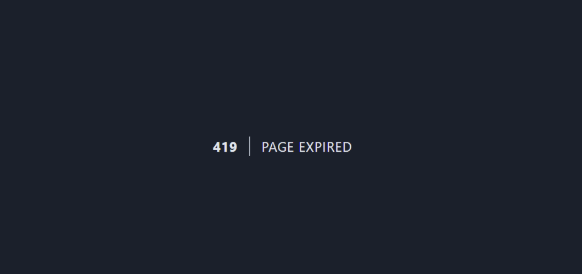
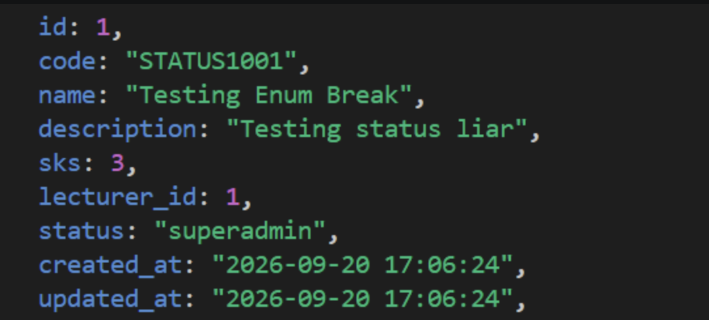

### Nama : Fatika Rizki Syahada
#### NIM : 10241030
---
READ — Telusuri satu siklus form gagal (30 menit)

1. Method apa yang menerima request? Di controller mana?

Jawab:
Saat pengguna mengisi form tambah mata kuliah lalu menekan tombol submit, form mengirim request menggunakan method **POST**. Request tersebut diterima oleh method `store()` pada controller yang menangani data mata kuliah.

Contohnya:

```php
public function store(StoreCourseRequest $request)
{
    $course = Course::create($request->validated());

    return redirect()
        ->route('courses.show', $course)
        ->with('success', 'Mata kuliah berhasil ditambahkan.');
}
```

Jadi, method yang menerima request adalah store() pada: app/Http/Controllers/CourseController.php

Untuk pengelolaan user, method store() juga digunakan pada:app/Http/Controllers/UserController.php

2. Di titik mana persisnya validasi terjadi — sebelum atau sesudah baris pertama method controller?

Jawab:
Validasi terjadi sebelum isi method store() dijalankan.
Hal ini karena controller menggunakan Form Request, yaitu public function store (StoreCourseRequest $request)

Laravel akan menjalankan validasi yang ada di StoreCourseRequest terlebih dahulu. Jika validasi gagal, isi method store() tidak langsung dijalankan.

Jadi urutannya adalah:
Request masuk lalu StoreCourseRequest melakukan validasi,
Jika Validasi gagal? Redirect kembali ke form,
Jika validasi berhasil, barulah kode di dalam store() dijalankan.

3. Ke mana Laravel me-redirect setelah gagal? Siapa yang menentukan tujuannya?

Jawab:
Jika validasi gagal, Laravel akan mengarahkan pengguna kembali ke halaman form sebelumnya.
Proses ini dilakukan otomatis oleh mekanisme validasi Laravel melalui ValidationException.

Laravel juga membawa beberapa data saat melakukan redirect, yaitu:
- Pesan error validasi.
- Input lama yang sebelumnya dikirim.

Data tersebut disimpan sementara melalui flash session, sehingga dapat digunakan ketika halaman form ditampilkan kembali.

4. Dari mana @error('sks') mengambil pesannya?

Jawab:
@error('sks') mengambil pesan dari hasil validasi Laravel ketika validasi pada field sks gagal.
Contohnya:

```php
@error('sks')
    <p>{{ $message }}</p>
@enderror
```

Pesan error tersebut berasal dari aturan validasi pada Form Request:
```php
'sks' => ['required', 'integer', 'between:1,6']
```

Misalnya pengguna memasukkan:
sks = 99

Nilai tersebut tidak sesuai dengan aturan:
```between:1,6```
karena SKS hanya boleh memiliki nilai 1 sampai 6.

Laravel kemudian membuat pesan error dan menyimpannya sementara dalam session. Pesan tersebut dapat ditampilkan menggunakan:
```@error('sks')```

5. Dari mana old('sks') mengambil nilainya? Berapa lama nilai itu bertahan?

Jawab:

old('sks') mengambil nilai yang sebelumnya dimasukkan pengguna ketika validasi gagal.
Contohnya pengguna memasukkan:
sks = 99
Kemudian validasi gagal karena nilai SKS hanya boleh 1 sampai 6.

Laravel menyimpan input tersebut sementara dalam flash session.
Pada form dapat digunakan:
<input 
    name="sks" 
    value="{{ old('sks') }}"
>
Dengan begitu, setelah kembali ke halaman form, nilai 99 masih muncul pada input. Nilai tersebut bertahan selama satu request berikutnya.


6. Buka DevTools → Application → Cookies. Temukan cookie session Laravel. Catat namanya.

Jawab:
Cookie session Laravel dapat ditemukan melalui browser dengan langkah:
DevTools -> Application -> Cookies -> Pilih domain aplikasi

Nama cookie session default Laravel adalah: ```laravel_session```
Cookie tersebut digunakan sebagai identitas session pengguna.

Data seperti error validasi dan input lama tidak langsung disimpan di cookie. Data tersebut disimpan pada tempat penyimpanan session sesuai konfigurasi:```SESSION_DRIVER```

Jika menggunakan:
```SESSION_DRIVER=file```
maka data session disimpan di:
```storage/framework/sessions```

Jadi cookie hanya menyimpan ID session yang digunakan Laravel untuk menemukan data session tersebut.


--- 

# BREAK — Tujuh Kerusakan

| No | Yang Dirusak | Prediksi Sebelum Dijalankan | Hasil yang Diamati | Kesimpulan |
|----|--------------|-----------------------------|--------------------|------------|
| 1 | Menghapus `@csrf` dari form, lalu mengirim form | Laravel akan menolak request POST karena token CSRF tidak ditemukan atau tidak valid. | Muncul error **419 Page Expired** saat form dikirim. | `@csrf` digunakan untuk melindungi aplikasi dari serangan CSRF dengan memastikan request berasal dari aplikasi yang valid. |
| 2 | Mengganti `$request->validated()` menjadi `$request->all()`, lalu mengirim field liar melalui `curl` | Semua data yang dikirim pengguna akan diteruskan tanpa penyaringan, termasuk field yang tidak seharusnya diproses. | Field tambahan yang dikirim melalui request dapat ikut masuk ke proses penyimpanan. | `$request->validated()` lebih aman karena hanya mengambil data yang sudah lolos validasi. Menggunakan `$request->all()` dapat membuka risiko mass assignment. |
| 3 | Menghapus validasi `exists:users,id` pada `lecturer_id` dan mengirim `lecturer_id=99999` | Data dengan foreign key yang tidak ada di database tetap dapat masuk. | Mata kuliah tersimpan dengan `lecturer_id` yang tidak memiliki user terkait. | Validasi `exists` memastikan relasi foreign key tetap valid dan mencegah data yatim. |
| 4 | Menghapus validasi `in:...` pada `status`, lalu mengirim `status=superadmin` | Nilai status apa pun dapat diterima karena tidak ada pembatasan. | Data dengan status `superadmin` berhasil masuk meskipun bukan status yang diperbolehkan. | Validasi `in` menjaga agar nilai enum tetap sesuai aturan aplikasi. |
| 5 | Menghapus `->withQueryString()`, melakukan pencarian lalu pindah halaman 2 | Parameter pencarian atau filter tidak akan ikut terbawa pada pagination berikutnya. | Setelah pindah halaman, filter pencarian hilang dan daftar kembali tanpa filter. | `withQueryString()` digunakan untuk mempertahankan state filter dan pencarian pada pagination. |
| 6 | Mengganti `return redirect()` menjadi `return view()` pada `store`, lalu menekan F5 setelah simpan | Browser akan mengirim ulang request POST sebelumnya sehingga data dapat tersimpan ulang. | Muncul peringatan **Confirm Form Resubmission** atau data dapat terduplikasi. | Pola PRG (**Post → Redirect → Get**) mencegah pengiriman ulang data ketika halaman di-refresh. |
| 7 | Menghapus `old(...)` dari input form, lalu mengirim form dengan satu kesalahan | Setelah validasi gagal, input yang sudah diisi pengguna akan hilang. | Pengguna harus mengisi ulang seluruh form meskipun hanya satu field yang salah. | `old()` mengambil input sebelumnya dari flash session agar pengguna tidak perlu mengisi ulang seluruh form. |

Tahapan Break : 

1. Hapus `@csrf` dari form, lalu kirim

`@csrf` digunakan untuk melindungi aplikasi Laravel dari request palsu yang memanfaatkan session pengguna yang sedang login.

### Langkah

Buka file:

```text
courses/create.blade.php
```

Kemudian hapus:

```php
@csrf
```

### Hasil



Error terjadi karena Laravel tidak menemukan atau tidak dapat memvalidasi CSRF token pada request yang masuk. Hal ini terjadi karena `@csrf` pada form tambah mata kuliah sudah dihapus.


2. Ganti `$request->validated()` menjadi `$request->all()`, lalu kirim field liar lewat `curl`

Pada `CourseController` atau `UserController`, terdapat:

```php
$request->validated()
```

pada fungsi `store`. Bagian tersebut digunakan untuk mengambil data yang sudah melewati proses validasi.

Pengujian ini dilakukan untuk melihat apa yang terjadi jika menggunakan `$request->all()`, sehingga seluruh data yang dikirim oleh request dapat diterima.

Sebelum melakukan pengujian, jika ingin mencoba mengubah status menjadi `superadmin`, ubah:

```php
'status'      => ['required', 'in:draft,active,archived']
```

menjadi:

```php
'status'      => ['required']
```

pada `StoreCourseRequest`.

### Hasil



Hasil tersebut terjadi karena seluruh data dari request dapat diterima tanpa melalui pembatasan validasi seperti sebelumnya.

3. Hapus validasi `exists:users,id` pada `lecturer_id`, lalu kirim `lecturer_id=99999`

Pada `StoreCourseRequest`, ubah:

```php
'lecturer_id' => ['required', 'exists:users,id']
```

menjadi:

```php
'lecturer_id' => ['required']
```

Dengan perubahan tersebut, Laravel hanya mengecek apakah `lecturer_id` terisi. Laravel tidak lagi memastikan apakah ID tersebut benar-benar terdapat pada tabel `users`.

Selain itu, bagian foreign key berikut juga perlu dihapus:

```php
->constrained('users')
->restrictOnDelete();
```

Bagian tersebut membuat foreign key constraint pada database. Constraint tersebut tetap akan mengecek apakah `lecturer_id` memiliki data yang sesuai pada tabel `users`.

Jadi, walaupun validasi `exists:users,id` di Laravel sudah dihapus, database tetap dapat menolak `lecturer_id=99999` jika ID tersebut tidak terdapat pada tabel `users`.

Sedangkan:

```php
->restrictOnDelete();
```

digunakan untuk mengatur penghapusan user yang masih digunakan oleh course. Bagian ini tidak berhubungan dengan proses memasukkan `lecturer_id` baru.

Hasil tersebut terjadi karena validasi `exists` pada `lecturer_id` dan foreign key pada database sudah dihapus. Akibatnya, data dengan `lecturer_id` yang tidak memiliki relasi pada tabel `users` tetap dapat disimpan.

4. Hapus validasi `in:...` pada `status`, lalu kirim `status=superadmin`

Pada `StoreCourseRequest`, ubah:

```php
'status'      => ['required', 'in:draft,active,archived']
```

menjadi:

```php
'status'      => ['required']
```

Kemudian hapus penggunaan enum pada migration:

```php
$table->enum('status', [
                'draft',
                'active',
                'archived'
            ])->default('draft');
```

menjadi:

```php
$table->string('status')->default('draft');
```

### Hasil


Perubahan tersebut membuat Laravel hanya memastikan bahwa field `status` memiliki nilai. Isi dari status tidak lagi dibatasi hanya pada `draft`, `active`, atau `archived`.

Namun, jika database masih menggunakan tipe `enum`, nilai `status=superadmin` tetap akan ditolak oleh database.

5. Hapus `->withQueryString()`, lakukan pencarian lalu klik halaman 2

Hapus:

```php
->withQueryString()
```

pada `UserController` maupun `CourseController`.

`withQueryString()` digunakan untuk mempertahankan parameter pencarian atau filter pada URL ketika pengguna berpindah halaman pagination.

Jika bagian tersebut dihapus, parameter query seperti `q` atau `role` tidak ikut dibawa ketika pengguna berpindah ke halaman berikutnya.

Akibatnya, ketika pengguna melakukan pencarian lalu membuka halaman 2, filter atau kata pencarian dapat hilang dan hasil yang ditampilkan menjadi tidak sesuai dengan pencarian sebelumnya.

6. Ganti `return redirect()` menjadi `return view()` pada `store`, lalu tekan F5 setelah simpan

Pada `CourseController`, ubah:

```php
return redirect()->route('courses.index')
    ->with('success', 'Mata kuliah berhasil ditambahkan.');
```

menjadi:

```php
return view()->route('courses.index')
    ->with('success', 'Mata kuliah berhasil ditambahkan.');
```

Perubahan tersebut menyebabkan browser tetap berada pada hasil request `POST`.

Jika halaman kemudian di-refresh menggunakan `F5`, browser dapat mengirim ulang request `POST`. Akibatnya, data yang sebelumnya sudah disimpan dapat terkirim kembali dan berpotensi menyebabkan data duplikat.

Hal ini berbeda dengan penggunaan `redirect()`. `redirect()` menerapkan pola **Post/Redirect/Get (PRG)**. Setelah data berhasil disimpan melalui `POST`, browser diarahkan ke halaman `GET`, sehingga ketika halaman di-refresh, browser tidak mengirim ulang request `POST`.

7. Hapus `old()` dari semua input, lalu kirim form dengan satu kesalahan

Pada file:

```text
courses/create.blade.php
```

atau input form lainnya, hapus penggunaan:

```php
value="{{ old('name') }}"
```

menjadi:

```php
value=""
```

Perubahan tersebut menyebabkan data yang sebelumnya sudah diisi pengguna hilang ketika validasi gagal dan Laravel mengarahkan kembali ke halaman form.

Tanpa `old()`, halaman form tidak dapat mengambil kembali nilai input sebelumnya dari session. Akibatnya, pengguna harus mengisi ulang seluruh form.

Hal ini berbeda ketika menggunakan `old()`. Saat validasi gagal, Laravel menyimpan input sebelumnya sementara di session. Fungsi `old()` kemudian mengambil kembali nilai tersebut untuk ditampilkan pada form.

Dengan begitu, pengguna hanya perlu memperbaiki bagian input yang salah tanpa harus mengisi ulang seluruh form.
