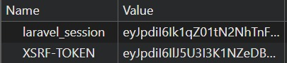
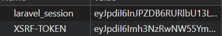

### Nama : Indriani Anwar
#### NIM : 10241036
---
READ — Bedah starter kit (30 menit)

1. Berkas mana yang menangani POST login? Method apa?

Berkas yang menangani post login adalah ```app/Http/Controllers/LoginController.php``` seperti yang tertera pada Route /login
```php
Route::post('/login',
    [LoginController::class, 'login']
);
```

Method yang digunakan adalah login(). Method ini menerima parameter input berupa email dan password, melakukan validasi, kemudian menjalankan proses autentikasi menggunakan Auth::attempt().

```php
    public function login(Request $request)
    {

        $credentials = $request->validate([
            'email' => 'required|email',
            'password' => 'required'
        ]);


        $attempt = Auth::attempt($credentials);
```

2. Di baris mana Auth::attempt() atau setaranya dipanggil?

```Auth::attempt()``` dipanggil pada ```app/Http/Controllers/LoginController.php``` dalam method login()

```php
    public function login(Request $request)
    {

        $credentials = $request->validate([
            'email' => 'required|email',
            'password' => 'required'
        ]);


        $attempt = Auth::attempt($credentials);
```
```Auth::attempt()``` digunakan untuk menjalankan proses verifikasi email dan password sebagai parameter input yang tersimpan di dalam database. Jika pengecekan menghasilkan nilai valid maka ```Auth::attempt()``` akan mengembalikan nilai true.

3. Temukan session()->regenerate(). Kenapa ia ada di situ?

```php
    if ($attempt) {

            $request->session()->regenerate();


            $user = Auth::user();
```
```session()->regenerate()``` terdapat pada LoginController.php pada method login() dan terletak setelah proses verifikasi```$attempt = Auth::attempt($credentials);```. Penempatan tersebut dikarenakan user harus terautentikasi terlebih dahulu, dan fungsinya untuk mengganti ID session pengguna setelah login berhasil. Hal ini dilakukan untuk mencegah serangan session fixation, yaitu kondisi ketika penyerang menggunakan session ID yang sudah diketahui sebelum pengguna melakukan login.

4. Di mana kata sandi di-hash? Cari cast hashed di model User.

Kata sandi di-hash pada ```app/Models/User.php``` pada konfigurasi cast yang membuat Laravel otomatis melakukan hashing terhadap password sebelum disimpan ke database sehingga password pengguna tidak tersimpan dalam bentuk teks asli.

```php
    protected function casts(): array
    {
        return [
            'email_verified_at' => 'datetime',
            'password' => 'hashed',
        ];
    }
```

5. Buka DevTools → Cookies sebelum dan sesudah login. Bandingkan nilai cookie session.
perbandingan sebelum login
 
dengan sesudah login
 

laravel_session berubah setelah proses login berhasil. Perubahan tersebut terjadi karena aplikasi menjalankan session()->regenerate() setelah autentikasi berhasil. Pergantian session ID ini bertujuan untuk mencegah serangan session fixation dengan memastikan pengguna mendapatkan session baru setelah login.

6. Logout, lalu tekan tombol back. Apa yang terjadi? Kenapa?
Setelah melakukan logout dan menekan tombol back, halaman dashboard masih dapat terlihat karena browser menampilkan halaman dari cache. Namun ketika mencoba mengakses fitur yang membutuhkan autentikasi seperti Mata Kuliah Saya, Tugas dan Pengumpulan, sistem meminta pengguna untuk login kembali. Hal ini menunjukkan bahwa session pengguna telah berhasil dihancurkan saat logout melalui Auth::logout(), session()->invalidate(), dan session()->regenerateToken() sehingga pengguna tidak dapat mengakses fitur yang membutuhkan hak autentikasi.

---
BREAK — Delapan kerusakan (50 menit)

1. Menghapus `session()->regenerate()` pada Login

Menghapus kode:

```php
$request->session()->regenerate();
```

pada proses login di `LoginController`. Setelah kode dihapus, session ID tidak diperbarui setelah login berhasil. Session ID akan berubah setelah login karena Laravel membuat session baru. Tanpa regenerasi session, session lama tetap dapat digunakan. Penghapusan `session()->regenerate()` menyebabkan risiko session fixation karena session lama masih dapat digunakan setelah pengguna melakukan login.

2. Menghapus `Gate::authorize()` tetapi Membiarkan `@can`

Menghapus pengecekan:

```php
Gate::authorize('update', $course);
```

tetapi tetap menggunakan:

```blade
@can('update', $course)
```

Tombol edit dapat disembunyikan oleh Blade, tetapi URL endpoint masih dapat diakses secara langsung.
`@can` hanya mengatur tampilan dan bukan pengamanan utama. Pemeriksaan otorisasi tetap harus dilakukan pada controller.

3. Dosen A Mengubah Mata Kuliah Dosen B Menggunakan CURL

Mengirim request PUT sebagai dosen A terhadap data mata kuliah milik dosen B. Jika Policy benar, sistem menolak akses dengan:

```
403 Forbidden
```
Policy harus memeriksa kepemilikan objek agar dosen tidak dapat mengubah data dosen lain.


4. Mahasiswa Membuka Submission Mahasiswa Lain (IDOR)

Mengubah ID submission pada URL agar menunjuk ke submission mahasiswa lain.

Akses harus ditolak dengan:

```
403 Forbidden
```

Sistem harus membatasi akses berdasarkan kepemilikan data untuk mencegah IDOR.

5. Mengubah Query Index Menjadi `Course::paginate()`

Mengubah query menjadi:

```php
Course::paginate(15);
```

tanpa filter berdasarkan role. Mahasiswa dapat melihat daftar mata kuliah yang seharusnya tidak dimiliki. Filter akses harus dilakukan pada query database, bukan hanya pada tampilan.

6. Mengirim `role=admin` pada Form Edit Profil

Menambahkan parameter:

```
role=admin
```

pada request edit profil. Jika field role dapat diubah melalui mass assignment, pengguna dapat meningkatkan hak akses menjadi admin. Field sensitif seperti role harus dilindungi dan tidak boleh dapat diubah oleh pengguna biasa.

7. Menghapus Cast `hashed` pada Password

Menghapus:

```php
'password' => 'hashed'
```

dari model User kemudian membuat user baru. Password dapat tersimpan dalam bentuk teks asli apabila hashing tidak diterapkan. Password wajib disimpan menggunakan hashing agar tidak dapat dibaca langsung dari database.

8. Menyalin Cookie Session ke Browser Lain

Menyalin cookie:

```
laravel_session
```

ke browser lain setelah login.  Jika cookie dapat digunakan untuk masuk sebagai pengguna lain, maka session dapat disalahgunakan. Cookie session harus menggunakan pengaturan keamanan seperti HttpOnly, Secure, dan SameSite.

---
1.  Apa beda autentikasi dan otorisasi? Tunjukkan satu contoh masing-masing di kode Anda.

Autentikasi adalah proses memastikan identitas pengguna.

`app/Http/Controllers/LoginController.php`

Kode:

``` php
$attempt = Auth::attempt($credentials);
```

Sedangkan otorisasi menentukan hak akses pengguna setelah login.

Cek pada Policy atau Controller.

Contoh:

``` php
Gate::authorize('update', $assignment);
```

2. Tunjukkan Policy yang Anda tulis. Jelaskan tiap barisnya.

``` php
public function update(User $user, Assignment $assignment): bool
{
    return $user->id === $assignment->course->lecturer_id
        || $user->role === 'admin';
}
```

`update()` mengatur izin perubahan data. - `$user` adalah
pengguna yang login.`$assignment` adalah data yang akan diubah.
Pengecekan dilakukan berdasarkan kepemilikan data dan role.

3.  Kenapa @can di Blade tidak cukup? Peragakan dengan mengakses URL langsung.

Cek Blade:

``` blade
@can('update', $assignment)
    Edit
@endcan
```

`@can` hanya menyembunyikan tombol.

Jika `Gate::authorize()` dihapus tombol tetap hilang. Namun, URL masih
dapat dibuka.

4. Buka docs/keamanan.md. Pilih satu baris, jelaskan bagaimana ia ditutup, lalu buktikan dengan curl.

Contoh

```
GET /submissions/{submission}
```

Mahasiswa dapat menebak ID submission milik mahasiswa lain, misalnya:

```
/submissions/5
```

Kemudian mencoba melihat atau mengambil data tugas milik pengguna lain. Kasus ini termasuk **IDOR (Insecure Direct Object Reference)** karena akses hanya berdasarkan ID pada URL tanpa memastikan kepemilikan data.

Kerentanan tersebut ditutup menggunakan:

```
SubmissionPolicy@view
```

Dengan pengecekan:

```php
return $submission->user_id === $user->id;
```

Pengecekan tersebut memastikan bahwa user hanya dapat melihat submission miliknya sendiri.
Jika ID submission bukan milik user yang sedang login, maka akses ditolak.

Melakukan request sebagai Mahasiswa A terhadap submission milik Mahasiswa B:

```bash
curl -X GET \
http://localhost:8000/submissions/5 \
-H "Cookie: laravel_session=SESSION_ID"
```

Response:

```
403 Forbidden
```

Karena submission tersebut bukan milik user yang sedang login.
Policy berhasil menutup celah IDOR karena sistem tidak hanya mempercayai ID yang dikirim melalui URL, tetapi juga melakukan pengecekan kepemilikan data menggunakan `SubmissionPolicy@view`.

5.  Kenapa kata sandi di-hash, bukan dienkripsi? Apa konsekuensinya untuk fitur lupa password?

``` php
'password' => 'hashed'
```

Password disimpan dalam bentuk hash. Dan Password asli tidak
dapat dikembalikan. Hash digunakan karena password tidak boleh dapat diketahui kembali. Konsekuensi: Fitur lupa password menggunakan link reset password, bukan
mengirim password lama.

6. Apa fungsi session()->regenerate() saat login?

``` php
$request->session()->regenerate();
```

Mengganti ID session setelah login berhasil, dan mencegah session fixation attack. Sehingga Sebelum login dan sesudah login nilai `laravel_session`
berubah.

7. Kenapa daftar mata kuliah tidak boleh diambil semua lalu disaring di view?

Tidak boleh:

``` php
Course::paginate(15);
```

lalu menyaring di view.

Semua data sudah diambil sehingga dapat menyebabkan kebocoran. Sehingga menggunakan query berdasarkan role:

``` php
$user->courses()
```

atau:

``` php
$user->taughtCourses()
```

8. Tunjukkan satu bagian yang Anda tulis dengan bantuan AI. Apa yang Anda ubah, dan kenapa?

```php
public function update(User $user, Assignment $assignment): bool
{
    return match ($user->role) {
        'admin' => true,
        'dosen' => $assignment->course->lecturer_id === $user->id,
        default => false,
    };
}
```

AI membantu membuat struktur awal Policy, kemudian saya menyesuaikan kode berdasarkan struktur database KampusLMS.

Perubahan yang dilakukan adalah menyesuaikan pengecekan kepemilikan data, karena Assignment pada project ini berhubungan melalui:

```
Assignment → Course → lecturer_id
```

Sehingga dosen hanya dapat mengubah Assignment pada mata kuliah yang dimilikinya.

Perubahan dilakukan agar kode sesuai dengan aturan akses dan kebutuhan aplikasi.


