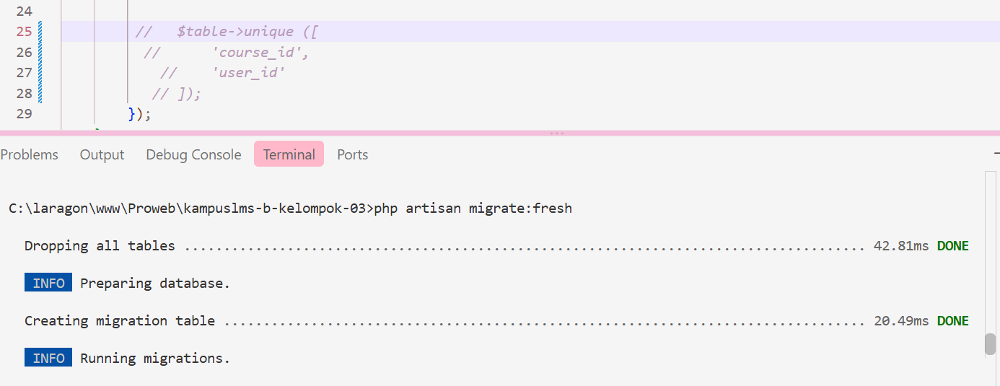
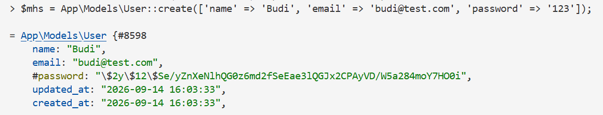
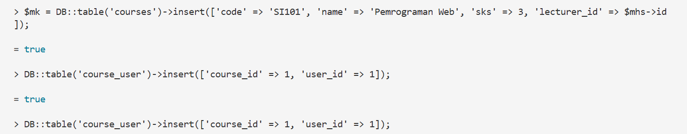
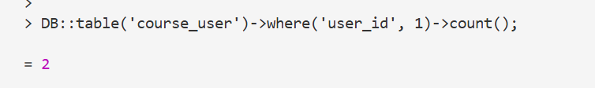
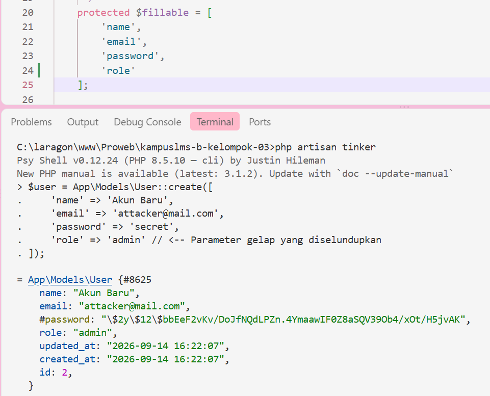
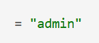
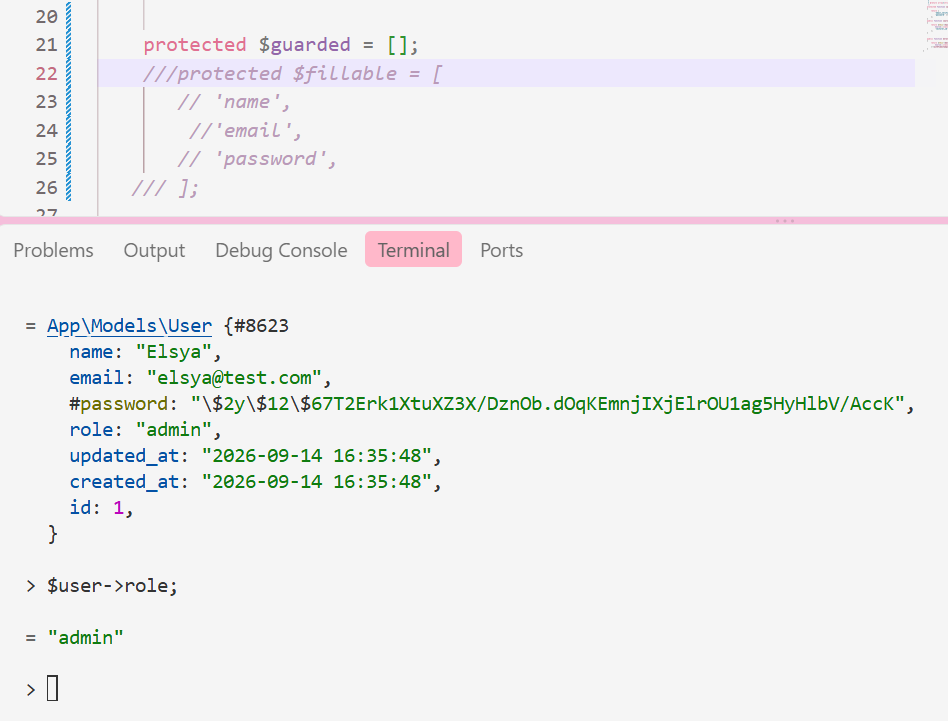
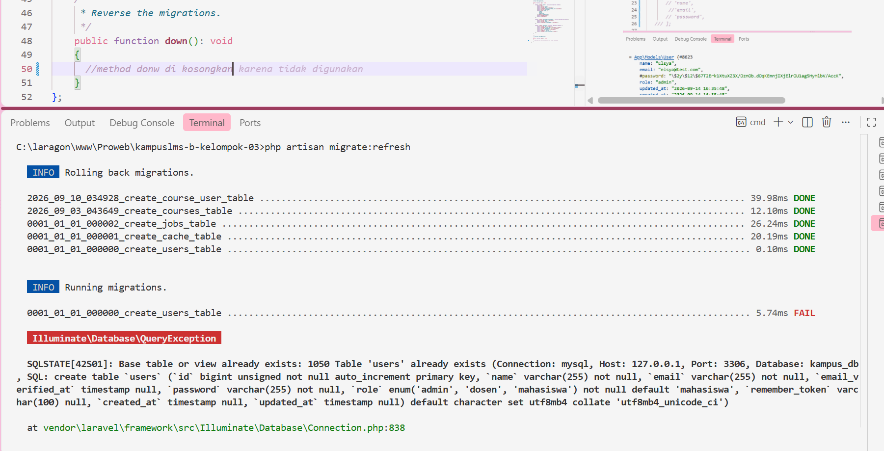
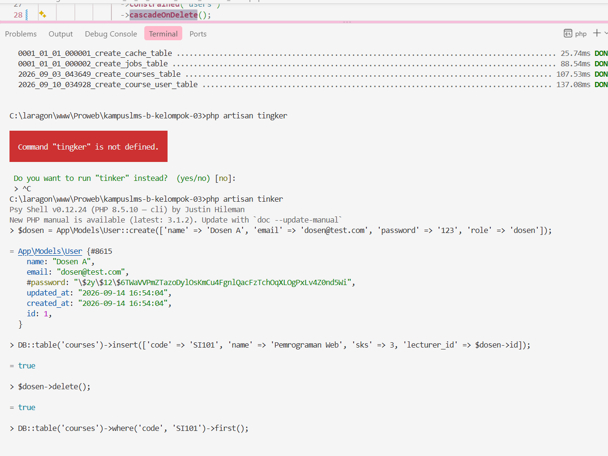

## Elsya Nur Aulia Handayani
## 10241026 

READ — Baca skema sebelum menulisnya (30 menit)

ERD 

1. Untuk setiap foreign key, tentukan perilaku onDelete-nya dan tuliskan alasannya.

| Foreign Key | Relasi | `onDelete` | Alasan |
|---|---|---|---|
| `courses.lecturer_id → users.id` | User (dosen) mengajar course | `restrict` / `no action` | Mata kuliah tidak boleh otomatis terhapus ketika dosen dihapus karena data akademik harus tetap tersedia. Penghapusan dosen harus dicek terlebih dahulu atau dialihkan ke dosen lain. |
| `course_user.course_id → courses.id` | Course memiliki peserta | `cascade` | Data peserta hanya relevan jika mata kuliah masih ada. Jika mata kuliah dihapus, data pendaftaran peserta juga harus ikut dihapus agar tidak menjadi data yatim (orphan record). |
| `course_user.user_id → users.id` | User terdaftar dalam course | `cascade` | Jika akun mahasiswa/dosen dihapus, data keikutsertaannya pada mata kuliah tidak diperlukan lagi sehingga dapat dihapus otomatis. |
| `materials.course_id → courses.id` | Course memiliki materi | `cascade` | Materi tidak memiliki arti tanpa mata kuliah induknya. Jika course dihapus, semua materi terkait ikut dihapus. |
| `materials.uploaded_by → users.id` | User mengunggah materi | `set null` | Riwayat materi sebaiknya tetap tersedia walaupun akun pengunggah dihapus. Kolom `uploaded_by` harus dibuat nullable agar dapat dikosongkan. |
| `assignments.course_id → courses.id` | Course memiliki tugas | `cascade` | Tugas merupakan bagian dari mata kuliah. Jika mata kuliah dihapus, tugas juga harus dihapus. |
| `assignments.created_by → users.id` | User membuat tugas | `set null` | Informasi tugas tetap penting untuk histori pembelajaran meskipun pembuat tugas sudah tidak aktif. |
| `submissions.assignment_id → assignments.id` | Assignment memiliki submission | `cascade` | Submission hanya bermakna sebagai jawaban dari tugas tertentu. Jika tugas dihapus, pengumpulan mahasiswa juga tidak diperlukan. |
| `submissions.user_id → users.id` | User mengumpulkan tugas | `restrict` / `set null` | Nilai dan histori pengumpulan mahasiswa perlu dipertahankan untuk kebutuhan akademik. Data tidak sebaiknya langsung hilang. |
| `grades.submission_id → submissions.id` | Submission memiliki nilai | `cascade` | Nilai tidak dapat berdiri sendiri tanpa submission yang dinilai. Jika submission hilang, nilai terkait juga harus ikut hilang. |
| `grades.graded_by → users.id` | User memberi nilai | `set null` | Riwayat nilai tetap tersimpan walaupun akun dosen pemberi nilai sudah dihapus. |
| `notifications.notifiable_id → users.id` | User menerima notifikasi | `cascade` | Notifikasi merupakan data milik user tertentu sehingga dapat dihapus ketika user sudah tidak ada. |

2. Jawab: kalau seorang dosen dihapus, apa yang terjadi pada mata kuliahnya? Kenapa dirancang begitu?

Jika seorang dosen dihapus, maka mata kuliahnya tidak ikut terhapus karena relasi `courses`.`lecturer_id` menggunakan `restrict` atau `no action`. Database akan menolak penghapusan dosen jika masih ada mata kuliah yang terhubung dengannya. Hal ini dilakukan agar data akademik tetap terjaga, karena mata kuliah masih memiliki keterkaitan dengan peserta, materi, tugas, submission, dan nilai mahasiswa. Jika menggunakan `cascade`, banyak data penting bisa ikut hilang. Oleh karena itu, mata kuliah harus dipindahkan terlebih dahulu ke dosen lain sebelum dosen tersebut dihapus.

Penghapusan dosen secara otomatis menggunakan `cascade` dapat menyebabkan kehilangan banyak data yang masih dibutuhkan, seperti riwayat pembelajaran dan aktivitas mahasiswa. Oleh karena itu, sistem sebaiknya mencegah penghapusan dosen secara langsung atau menyediakan mekanisme pemindahan mata kuliah kepada dosen lain. Dengan rancangan ini, data akademik tetap tersimpan meskipun akun dosen sudah tidak aktif.

4. Jawab: kenapa grades.submission_id bersifat unique, bukan sekadar index biasa?

`grades.submission_id` dibuat **unique** karena satu pengumpulan tugas (submission) seharusnya hanya memiliki satu nilai.

Misalnya, mahasiswa mengumpulkan Tugas 1 satu kali. Maka sistem hanya boleh menyimpan satu nilai untuk tugas tersebut. Jika `submission_id` hanya menggunakan index biasa, bisa saja satu submission memiliki dua atau lebih nilai yang berbeda sehingga menimbulkan kebingungan mengenai nilai mana yang benar.

Dengan menggunakan `unique`, database akan menolak data duplikat sehingga setiap submission hanya memiliki satu nilai. Hal ini membuat data nilai lebih rapi, konsisten, dan mengurangi kesalahan dalam pengolahan nilai mahasiswa.

BREAK — Lima kerusakan (45 menit)
#	Yang dicoba	Yang harus Anda amati
1. Hapus unique(['course_id','user_id']) dari course_user, lalu daftarkan mahasiswa yang sama dua kali	Data ganda lolos tanpa keluhan

Langkah Uji Coba:
Pada database/migrations/2026_09_12_080404_create_course_user_table.php, nonaktifkan baris:       

// $table->unique(['course_id', 'user_id']);
Jalankan php artisan migrate:fresh lalu buka php artisan tinker.         
jawab: 

Masukkan data mahasiswa yang sama ke mata kuliah yang sama sebanyak 2 kali:  

Output di Terminal: Angka yang keluar adalah 2. Database menerima kedua record tersebut tanpa adanya penolakan. Validasi di form/controller saja tidak cukup karena bisa ditembus oleh double-click. Database wajib memiliki $table->unique(['course_id', 'user_id']) sebagai validasi paling akhir agar mahasiswa tidak punya 2 status pendaftaran atau 2 nilai pada mata kuliah yang sama.

2. Tambahkan role ke $fillable model User, lalu kirim request pembuatan user dengan role=admin lewat form yang tidak punya field role	Mass assignment nyata — Anda baru saja jadi admin

jawab: Membuktikan bahaya mass assignment jika atribut sensitif penentu hak akses dibiarkan terbuka.
Langkah Uji Coba:
Pada `app/Models/User.php`, tambahkan 'role' ke properti $fillable:
php
protected $fillable = ['name', 'email', 'password', 'role'];

Output di Terminal: Menghasilkan string "admin". Pengguna publik berhasil membuat akun dengan hak istimewa admin.

di sisi frontend tidak bisa dijadikan patokan keamanan karena pengguna bisa memanipulasi request lewat curl atau Inspect Element. Kolom krusial seperti role atau score pantang masuk ke $fillable. Pengisian peran harus ditentukan secara eksplisit di level controller atau sistem otorisasi.

3. Ganti seluruh $fillable dengan protected $guarded = []; lalu ulangi nomor 2	Kenapa $guarded kosong dilarang

`$guarded` = []; tidak disarankan karena membuat semua kolom pada tabel bisa diisi secara bebas oleh pengguna. Akibatnya, data yang seharusnya tidak boleh diubah, seperti role, bisa ikut dikirim melalui request.

Pada percobaan ini, setelah `$fillable` diganti menjadi `$guarded` = [];, saya mengulangi percobaan sebelumnya dan berhasil membuat akun dengan role = admin. Padahal pada form tidak ada pilihan untuk memilih role.

Hal ini menunjukkan bahwa sistem menjadi kurang aman karena pengguna bisa mengubah data penting yang seharusnya hanya dapat diatur oleh sistem atau administrator. Oleh karena itu, lebih baik menggunakan `$fillable` agar hanya kolom tertentu saja yang boleh diisi oleh pengguna.

4. Kosongkan isi down() di satu migrasi, lalu jalankan php artisan migrate:refresh	Migrasi tidak reversible = CI merah

Saat isi `down()` dikosongkan, Laravel tidak tahu cara membatalkan (rollback) migration tersebut. Akibatnya saat menjalankan php artisan migrate:refresh, tabel yang seharusnya dihapus masih tetap ada di database.

Pada percobaan ini muncul error "Table 'users' already exists" karena tabel users tidak berhasil dihapus saat proses rollback, tetapi migration mencoba membuat tabel yang sama lagi.

Hal ini menunjukkan bahwa migration tidak bersifat reversible. Jika kondisi seperti ini terjadi pada GitHub Actions atau CI, proses testing migration bisa gagal dan status CI menjadi merah. Karena itu method down() harus selalu berisi perintah yang dapat mengembalikan perubahan yang dilakukan oleh method up().

5. Ubah restrictOnDelete pada lecturer_id menjadi cascadeOnDelete, lalu hapus satu dosen	Kehilangan data berantai

jawab: 

Setelah restrictOnDelete diubah menjadi cascadeOnDelete, saya mencoba menghapus satu dosen yang masih memiliki mata kuliah. Hasilnya, dosen berhasil dihapus dan mata kuliah yang terhubung dengannya juga ikut terhapus otomatis.

Dari percobaan ini terlihat bahwa cascadeOnDelete cukup berbahaya untuk data akademik. Jika satu dosen dihapus, data mata kuliah yang dia ajar juga bisa hilang. Padahal mata kuliah tersebut mungkin masih memiliki peserta, materi, tugas, atau nilai mahasiswa.

Karena itu lebih aman menggunakan restrictOnDelete. Dengan cara ini sistem akan menolak penghapusan dosen yang masih mempunyai mata kuliah, sehingga data penting tidak hilang begitu saja.